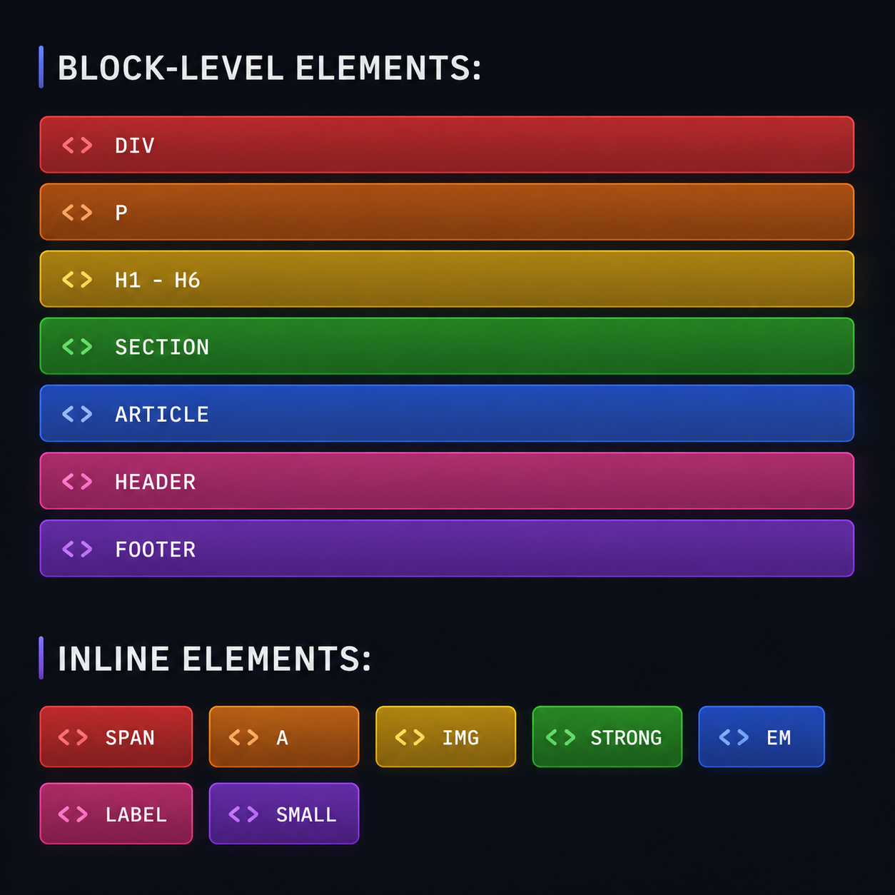

# HTML Elements

## **HTML Elements**

HTML elements are classified into two types based on how they occupy space on a web page:

1. Block-Level Elements
2. Inline Elements




## **Block-Level Elements**

A **Block-Level Element** always starts on a **new line** and occupies the **entire width** available, even if its content is small. These elements are mainly used to create the structure and layout of a webpage.

**Characteristics:**

- Starts on a new line.
- Occupies the full available width.
- Width and height can be changed using CSS.
- Can contain both block-level and inline elements.

**Examples:**

`<div>, <p>, <h1> to <h6>, <section>, <article>, <header>, <footer>, <form>`

**Example:**

```html
<h1>Welcome</h1>
<p>This is a paragraph.</p>
<div>This is a division.</div>
```

**Output:**

```
Welcome
This is a paragraph.
This is a division.
```

Each element starts on a new line.

---

## **Inline Elements**

An **Inline Element** does **not** start on a new line. It occupies only the space required by its content and appears alongside other inline elements.

**Characteristics:**

- Does not start on a new line.
- Occupies only the required width.
- Width and height generally cannot be applied directly.
- Mostly used for formatting text or small pieces of content.

**Examples:**

`<span>, <a>, <b>, <strong>, <i>, <em>, <u>, <mark>, <sup>, <sub>`

**Example:**

```html
<b>Bold</b>
<i>Italic</i>
<u>Underline</u>
```

**Output:**

```
Bold Italic Underline
```

All the elements appear on the same line.

---